# Decision tree(决策树)[^1]

*  Morgan, Sonquist (1963)[^３]

## 1. 基本算法：divide-and-conquer (分而治之策略)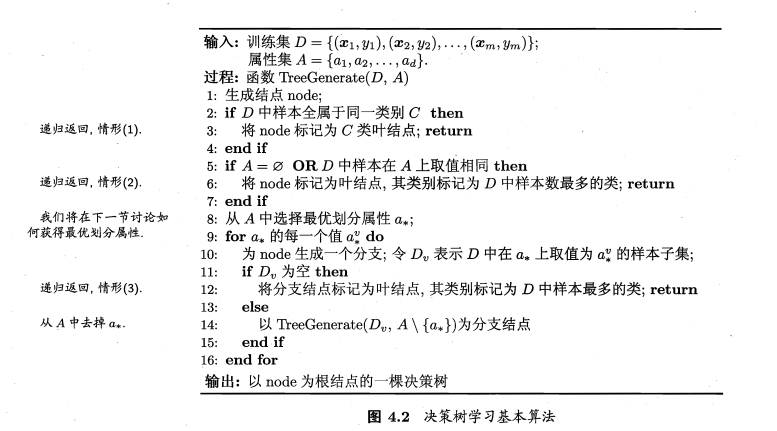

## 2. 第八步中的划分选择是如何划分的？

随着划分不断进行，使得分支结点所包含的样本尽可能属于同一类别（使得结点的纯度purity越来越高）

### 2.1 信息增益 (ID3：分类)

​	 **信息熵**information entropy：Ent(D)越小,D的纯度越高

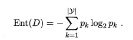

​	**信息增益** information gain ：Gain（D,a）

​		属性a有V个可能的取值{a^1^,...,a^V^},使用a来对样本集D进行划分，则会产生V个分支结点，其中第v个分支节点包含了D中所有在属性a上取值为a^v^的样本，记为D^v^.

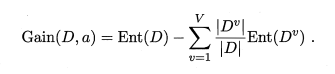

​		样本数越多分支结点的影响越大（权重）

​		Gain越大，使用属性a来进行划分所获得的纯度提升越大。

**第八步中选择属性：**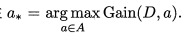（ID3决策树）

*例：D中所有样例：正例占p~1~=8/17,反例p~2~=9/17,计算得出信息熵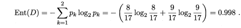*

*设用属性a进行划分，则得到3个子集，分别记为D^1^,D^2^,D^3^,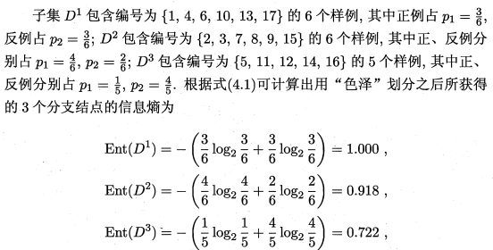*

*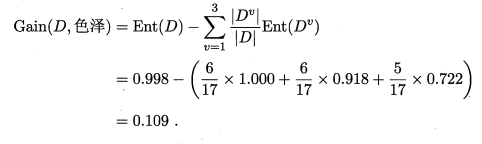*

*依次计算出其他属性的Gain，取最大值。*

### 2.2 增益率（C4.5：分类）

因为信息增益准则对可取值数目较多（例如编号）的属性有所偏好，为减少不利影响（决策树不具有泛化能力），采用增益率（gain ratio）来选择最优划分属性。（C4.5决策树算法）

* 定义式

  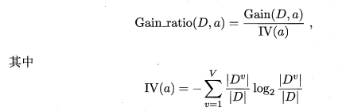

​	IV(a)为属性a的固有值，a的可能取值数目越多（V越大），IV(a)越大。

* 增益率准则对可取值数目较少的属性有所偏好，C4.5中使用启发式：先从候选划分属性中找出信息增益高于平均水平的属性，再从中选择增益率最高的。

###　2.3 基尼指数 (CART：分类和回归都能用)

基尼值：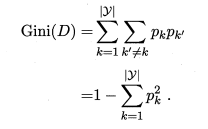

* Gini(D)反映从数据集D中随机抽取两个样本其类别标记不一致的概率。
* Gini(D)越小，Ｄ的纯度越高
* 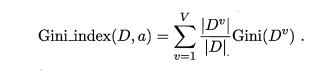
* 第八步中的选择最优属性可改为：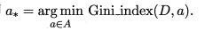

###　2.4 算法比较

1.  ID3 
   是最早提出的一种决策树方法，使用上述信息增益的方式建立。 缺点是只能处理离散型属性，并且对倾向于选择取值较多的属性 
2.  C4.5 
   使用增益率对信息增益进行扩充，以解决偏向取值较多的属性的问题。另外它可以处理连续型属性。
3.  CART 
   CART中用于选择变量的不纯性度量是Gini指数

**CART与ID3和C4.5的区别**

1. CART树是二叉树，而ID3和C4.5可以是多叉树
2. CART在生成子树时，是选择一个特征一个取值作为切分点，生成两个子树
3. 选择特征和切分点的依据是基尼指数，选择基尼指数最小的特征及切分点生成子树

## 3. 剪枝（pruning）处理

防止过拟合

### prepruning	postpruning

* 判断依据：该划分是否可以使决策树泛化能力提升
* 如何判断泛化性能是否提升？：划分验证集，
  * pre：若增加该枝节在验证集上正确率上升，则选择该划分。（因为基于“贪心”本质禁止某些在后续分支可能带来泛化能力提升的分支展开，带来欠拟合风险）
  * post：若减去该枝节正确率上升，则剪去。（欠拟合风险减低，开销上升）

## 4. 应用[^2]

· Evaluation of brand expansion opportunities for a business using historical sales data

· Determination of likely buyers of a product using demographic data to enable targeting of limited advertisement budget

· Prediction of likelihood of default for applicant borrowers using predictive models generated from historical data

· Help with prioritization of emergency room patient treatment using a predictive model based on factors such as age, blood pressure, gender, location and severity of pain, and other measurements

· Decision trees are commonly used in operations research, specifically in decision analysis, to help identify a strategy most likely to reach a goal.

**单棵决策树最大的优点在于，它可以被很轻松的可视化甚至是提取规则分类规则**。而集成学习很难做到。

## 5. History

Page 92

# References

[^1]: 周志华 机器学习（西瓜书）Chap 4：决策树， Chap 8：集成学习

[^2]: https://medium.com/greyatom/decision-trees-a-simple-way-to-visualize-a-decision-dc506a403aeb
[^３]: J. N. Morgan and J. A. Sonquist, “Problems in the analysis of survey data, and a proposal,” *J. AM. Stat. Assoc.*, vol. 58, pp. 415-434, 1963.