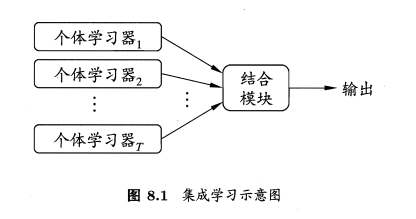
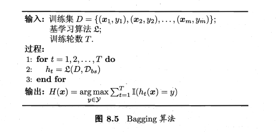

# Random Forest(随机森林)[^1]

* Bagging + 决策树 = 随机森林[^4]
* 提出者 Leo Breiman（2001）

随机森林顾名思义，使用随机的方式建立一个森林，森林里面有很多的决策树组成，随机森林的每一棵决策树之间是没有关联的。在得到森林之后，当有一个新的输入样本进入的死后，就让森林的每一棵决策树分别进行一下判断，看看这个样本应该属于哪一类（对于分类算法），然后看看哪一类能被选择最多，就预测这个样本为那一类。

## 1. 个体和集成

* 为了保证结合后获得好的集成，个体学习器应“好而不同”（准确性和多样性，然而这两者从根源上来说是矛盾的，本来这些模型就是为了解决同一问题而生成，不是独立的）

* 集成学习方法

  * 个体学习器之间存在强依赖关系，必须串行生成的序列化方法（Boosting）
  * 个体学习器之间不存在强依赖关系，可同时生成的序列化方法（Bagging，Random Forest）

  

## 2. Random Forest（RF）

 ###  Bagging与RF

Bagging：（基于bootstrap sampling）给定m个样本的数据集，先随机取出一个样本放入采样集中，再放回初始数据集（使得下一次采样时该样本仍有可能被选中），m次后得到含m个样本的采样集。然后采样出T个含m个训练样本的采样集，然后基于每个采样集训练出一个基学习器。

以上称为**自助采样过程**。

注意到：每个采样集中实际上只使用了63.2%的样本，剩下36.8%(bootstrapping:样本在m次采样中始终不被采样到的概率是0.368)可以用于验证泛化能力（out-of-bag estimate包外估计）

* 预测时，分类任务：简单投票法；回归任务：简单平均法。

RF在以决策树为基学习器构建Bagging的集成的基础上，进一步在决策树的训练过程中引入了**随机属性选择**。

对基决策树的每个结点，先从该结点的属性集合中随机选择一个包含k个属性的子集，然后再从这个子集中选择一个最优属性用于划分。

* Bagging使用的是确定性决策树，而RF使用的是随机性决策树。

### RF的构建过程

* 从原始训练集中使用Bootstrapping方法随机有放回采样选出m个样本，共进行T次采样，生成T个训练集
* 对于T个训练集，我们分别训练T个决策树模型
* 对于单个决策树模型，假设训练样本特征的个数为n，那么每次分裂时根据信息增益/信息增益比/基尼指数选择最好的特征进行分裂
* 每棵树都一直这样分裂下去，直到该节点的所有训练样例都属于同一类。在决策树的分裂过程中不需要剪枝
* 将生成的多棵决策树组成随机森林。对于分类问题，按多棵树分类器投票决定最终分类结果；对于回归问题，由多棵树预测值的均值决定最终预测结果

## 3. History

Page 190

# 4. Applications

- 在银行领域，随机森林算法可用于发现忠诚客户，也就是说客户经常从银行借贷并且按时还款，同样也能用于发现欺诈客户，即那些没有按时还款且行为异常的人。
- 在医疗领域，随机森林算法能够用于识别医药中的不同成分是否以正确的方式组合在以前，也可通过分析患者的病历识别疾病。
- 在股市方面，随机森林算法可以用于识别股票的波动行为，预估损失或收益。
- 在电子商务方面，随机森林算法可用于根据顾客的购物经历，预测他们是否喜欢系统推荐的商品。

在各个分类器较弱的情况下，随机森林可以用多个弱分类器组合在一起合成一个强分类器。

并且抗过拟合能力较强。

但是在回归问题中表现没有分类问题好（无法给出连续的输出）。

# References

[^1]: 机器学习 周志华 Chap 8：集成学习
[^2]:https://www.stat.berkeley.edu/~breiman/RandomForests/cc_home.htm

[^3]:https://zhuanlan.zhihu.com/p/38383952
[^4]:  L. Breiman, “Random forests,” *Machine learning*, vol. 45, pp. 5-32. 2001.
[^5]: Decision tree, RF,和神经网络的比较 https://www.zhihu.com/question/68130282

