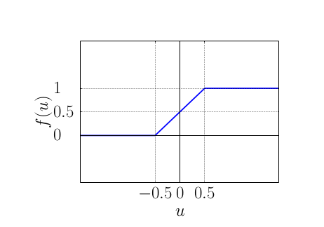

# Paper review

## Privacy-preserving Machine Learning

###  Two-server Model

* 将数据分成两部分分享给两个服务器，单一服务器无法得到完整数据
  * 前提是两个服务器互相不会collude
* 服务器之间交互，用户本身离线，让服务器去训练
* 比MPC更高效

## Linear Regression

* input data value pairs (**x**,y)s
  * **x** feature
  * y label
* output : model **w**
* $y^*$= w·x
* SGD(只涉及乘减法)

### When Apply to privacy-preserving

1. users share data and values(**x**,y)
2. servers initialize and secret share the model **w**
3. run SGD using pre-computed multiplication triplets

* 此处使用的是整数，而只有参数带小数decimal number时，线性回归和SGD算法才可以正确执行　**→Contribution 1**
* contribution 1: decimal multiplication in integer fields
  * add Step4: truncate the shares after every multiplication
  * 最后一个bit上会有一位误差
  * 比garbled circuit上的fix-point multiplication快四到八倍
  * 训练时间差不多

## Logistics Regression

* y = 0 or 1

* $y^*$= *f*(**w·x**)

* *f* ：激活函数

* SGD

  *  *f*涉及精确到小数的自然对数求幂

  * 传统方式：polynomial多项式，需要至少10次运算才可以完成

  * **→ Contribution 2：**

      secure-computation-friendly activation function

     适用于安全多方计算的激活函数

    

* 1. run our protocol for linear regression
  2. switch to garbled circuit for f
  3. switch back to arithmetic secret sharing

## Experiment

### linear

* 第一阶段：offline 与数据无关 生成乘法三元组 

* 第二阶段：online 训练模型

  

* Bottleneck: 为了减少offline处理时间：在用户帮助下生成multiplication triplets，t~offline~大幅降低，t~online~略上升，并且降低安全性

  * 前提是客户端不与服务器collude

### logistic

* 第一阶段：与linear相同
* 第二阶段：GC
* t~online~上升
* the **first** to apply to privacy-preserving logistic regression in 2-server model

### NN

* 模型简单，训练时间长

## Contributions

1. **线性回归，逻辑回归**，**神经网络** for **privacy-preserving**

- 综合使用secret sharing + arithmetic with precomputed triplets(三元组代数运算)+ garbled circuit

2. 性能提升 System

- faster（than prior work）
- Scale to larger datasets

Specificly:

- Decimal multiplication in integer fields
  - 在整数域上实现小数乘法
- Secure-computation-friendly activation function
- Vectorization(mini-batch SGD) 论文看不明白
- Privacy-preserving neutral networks

## Weakness

1. NN训练模型较为简单的情况下，训练时间较长
2. PPLR时若X的特征维度过小则效果较差