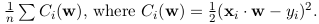

1. 为什么arithmetic circuit不能实现除法
2. 定点浮点数原理
3. 机器学习证明原理
4. 论文再看
   1. GMW LHE

# Arithmetic Circuit and Boolean Circuit[^1][^3]

arithmetic circuit

如何处理多项式***f***

1. upper bounding： 找一个电路可以表达
2. lower bounding： 降低这个电路的复杂度，证明目前的电路是最简单的

Note that we are interested in the formal computation of polynomials, rather than the functions that the polynomials define. For example, consider the polynomial  over the field of two elements this polynomial represents the zero function, but it is **not** the zero polynomial. This is one of the differences between the study of arithmetic circuits and the study of [Boolean circuits](https://en.wikipedia.org/wiki/Boolean_circuits). **In Boolean complexity, one is mostly interested in computing a function, rather than some representation of it** (in our case, a representation by a polynomial). This is one of the reasons that make Boolean complexity harder than arithmetic complexity. The study of arithmetic circuits may also be considered as one of the intermediate steps towards the study of the Boolean case,[[a\]](https://en.wikipedia.org/wiki/Arithmetic_circuit_complexity#cite_note-1) which we hardly understand.

arithmetic circuit 与boolean circuit 在representation上的区别：

* **boolean更在意computing a function??**

  **arithmetic 更在意representation??**

* **zero function和zero polynomial区别？？**

apply to the computation of polynomials over the rational numbers or over finite fields

|            | Boolena                                                      | Arithmetic |
| ---------- | ------------------------------------------------------------ | ---------- |
| 电路大     | 在电路较深时效果较好                                         | ×          |
| 电路小     | √                                                            | √          |
| 多项式运算 | When the field elements can be represented over some finite alphabet | √          |
|            |                                                              |            |

# Fix-point and float-point multiplication[^2]

## Fixed Point

* ##### Advantages and Disadvantages of Fixed Point Representation

  * 速度快
  * 存储量小

## Floating Point 

基于科学计数法（**Scientific Notation**）

+/- mantissa x 2^exponent^

# ML公式推导

1. Linear regression

   1. regression is a statistical process **to learn a function g** such that g(x~i~) ≈ y~i~
   2. the **function g** is assumed to be linear
   3. To learn the coefficient vector **w**, a cost function **C(w)** is defined and w is calculated by
      the optimization argmin~w~ C(**w**). In linear regression, a commonly used cost function is C(w) =
   4. The solution for this optimization problem can be computed by solving the linear system (X^T^ × X) × **w** = X^T^ × Y

2. Stochastic gradient descent (SGD)

   1. SGD is an effective approximation algorithm for approaching a local minimum of a function, step by step.
   2. **w** is initialized as a vector of random values or all 0s. In each iteration, a sample (**x**~i~, y~i~) is selected randomly and a coefficient w j is updated as 
   3. Substituting the cost function of linear regression, the formula becomes
   4. The phase to calculate the predicted output forward propagation: y~i~^∗^ = **x~i~· w**
   5. the phase to calculate the change **α(y~i~^∗^ − y ~i~ )x ~ij~** is called backward propagation.

3. Mini-batch:

   1. a small batch of samples are selected randomly and w is updated by averaging the partial derivatives of all samples on the current w.
   2. With mini-batch, the update function can be expressed in a vectorized form:

4. Logistic Regression

   1. 

   2. In logistic regression, the activation function is defined as the logistic function 

   3. the cost function is changed to the cross entropy function 

      

   4. The mini-batch SGD algorithm for logistic regression updates the coefficients in each iteration as follows:

5. Neural Networks

   1. Neural networks are a generalization of regression to learn more complicated relationships between high dimensional input and output data.
   2. Each node in the hidden layer and the output layer is an instance of regression and is associated with an activation function and a coefficient vector. Nodes are also called neurons. Popular activation functions include the logistic and the RELU function (f (u) = max(0, u)).
   3. For classification problems with multiple classes, usually a softmax function 
   4. 
   5. 
   6. 
   7. 
   8. 
   9. 

# Homomophic Encryption(同态加密)

在不解密的情况下分析数据

# References

[^1]: http://profile.iiita.ac.in/bibhas.ghoshal/lecture_slides_coa/ArithmeticCircuits.pdf
[^2]: https://andybargh.com/fixed-and-floating-point-binary/
[^3]: https://core.ac.uk/download/pdf/82199981.pdf