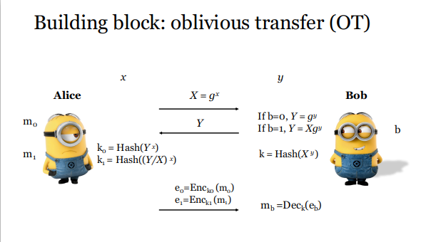

# Boolean circuit and arithmetic circuit[^1]

Boolean circuit: 

* Input: bit inputs and the gates of the circuit correspond to boolean operations (such as **XOR, AND**).
* Transform: one can always use some representation of the field elements, and translate the field operations to boolean operations.
* Application: many applications of, say, secure computation involve **non-arithmetic operations** (for example, integer comparison, which is a basic procedure in many computations). In this case, implementing this non-arithmetic operation as an arithmetic one would be very **inefficient**, and boolean circuits are a more natural representations.
*  boolean circuits correspond to arithmetic circuits over the field *F2*（？）

Arithmetic circuit:

* Input: elements of some field *F*, and the gates of the circuit correspond to arithmetic operations, *i e*, field operations (such as **additions and multiplications**).
* Transform:  Conversely, one **can always translate a boolean circuit to an arithmetic one**, by interpreting 0 as the neutral for addition over *F*, 1 as the neutral for multiplication over *F*, and translating the boolean gates to arithmetic operations (e.g. a OR b becomes a+b−a∗b).
* Application: In cryptography, it is quite common to rely on computation on field elements, and we **have cryptographic tools that allow us to manipulate field elements in an atomic way**, *id est*, treating a given field element as a single input (and not as a string of bits). In this case, it makes sense to represent the computation with an arithmetic circuit.
* arithmetic circuits are a generalization of boolean circuits to arbitrary fields

为什么Garbled Circuit使用的是Boolean Circuit？

* boolean circuit 理论上可以将任何函数表达出来
* 因为是bit输入，所以GCT表可以较为简单的写出来，并传达给对方，若是arithmetic circuit则可能表过大。

# Garbled Circuit 与 GMW协议的比较

|          | GC       | GMW                              |
| -------- | -------- | :------------------------------- |
| 算法深度 | constant | O(depth), interactive            |
| 电路结构 | Boolean  | can be generalized to arithmetic |
| 容易扩展 | ×        | √                                |

# Group Theory 群论[^2]

* n是一个正整数，对于任意一个正整数，被n除后余数会有几种可能，0、1....n-1。所有的这些剩余类所构成的集合叫**模n剩余类群**。
  * 其中的乘法运算定义为：相加后再和n求模
  * i.e.  Z~5~的生成元是1、2、3、4
  * Z~n~中的全部生成元：r是元的充分必要条件是r与n互素。

* 一个群若只有一个生成元就叫**循环群**(**cyclic group**)。
  * 生成循环群的单个特殊元素***g***称为生成元(**generator**)，群中元素的个数称为阶(**order**)。
* 
*  *有限阶的循环群和模n剩余类群同构，所以只需分析模n剩余类群就可以获得所有有限阶群得结构*

##　OT Protocal[^3]

* Alice生成秘钥：
  * Ａlice通过生成元g和阶q定义一个乘法循环群G
  * Alice在集合R={0, 1, 2, ..., q-1}中随机选择一个整数x
  * Alice根据群G的生成元和阶生成群中的一个元素 $X=g^x$
  * Alice将{G, q, g, X}作为公钥发布，x作为私钥妥善保存

*  Bob根据*{G, q, g, X}*生成群中的一个元素

$$
Y=\begin{cases}
		g^y, & \text{b=0}\\
		Xg^y,& \text{b=1}
	\end{cases}
$$

* 发送给Alice

* Alice根据自己拥有的资源m~0~和m~1~计算k~0~和k~1~
  $$
  k_0=Hash(Y^x)\\
  k_1=Hash((Y/X)^x)
  $$

* Bob计算k

$$
k=Hash(X^y)\\
If\ b=0, \ k_0=Hash(g^{xy}),k_1=Hash(g^{(y-x)x})\\
If\ b=1,\ k_0=Hash(g^{x(x+y)}),k_1=Hash(g^{xy})\\
k=Hash(g^{xy})
$$

* Alice将加密后的e~0~和e~1~发送给Bob，Bob匹配k计算出自己需要的信息

# References

[^1]: https://crypto.stackexchange.com/questions/46746/boolean-circuits-vs-arithmetic-circuits
[^2]:  https://bbs.pediy.com/thread-131611.htm
[^3]:https://en.wikipedia.org/wiki/Oblivious_transfer